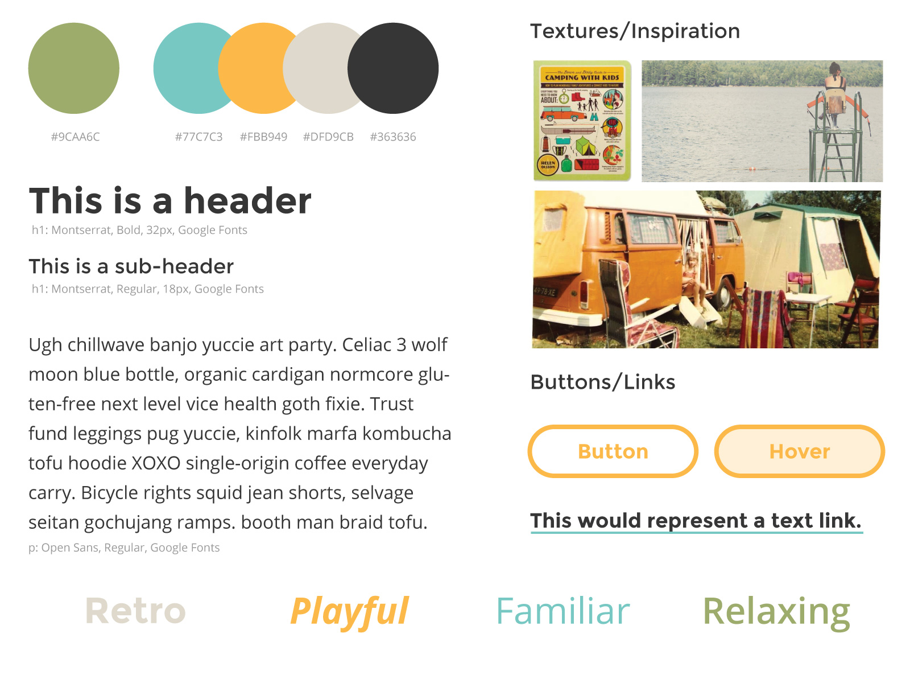

#Open Tiles

This is a repository for open source style tiles for developers who need design help and designers who need inspiration.

Style tiles were developed by Samantha Warren.  To learn more about style tiles, check out her website: [styletil.es](http://www.styletil.es).

</a><br />This work is licensed under a <a rel="license" href="http://creativecommons.org/licenses/by/4.0/">Creative Commons Attribution 4.0 International License</a>. So, if you don't want your designs to be open source, don't add them!

<a rel="license" href="http://creativecommons.org/licenses/by/4.0/">

#Labeling Style Tiles

Please make sure to include the following labels in your style tile:

- A descriptive name (theme, color scheme, etc.)
- All hex codes for colors
- All names of Typefaces/font weights used
- Where typefaces came from (Typekit, Google Fonts etc.)
- *Optional*: What type of project the style tile would work well for (mobile website, portfolio, blog, etc.)

#Saving Style Tiles

Please save all style tiles in the following format:

- An individual .jpg file for your stile tile with a descriptive name
- A folder with any original files (.psd, .ai) - can be zipped up if you want
- File sizes should be 100MB or less (otherwise you won't be able to push them to Github)

```
style_tile_name.jpg 

style_tile_project_name
│   style_tile_name.psd    
│   style_tile_name.ai

```


#Style Tile Example



#Attribution
Attribution is not required for these styles, but if you would like to add your name to the tile so people may attribute you, feel free!
